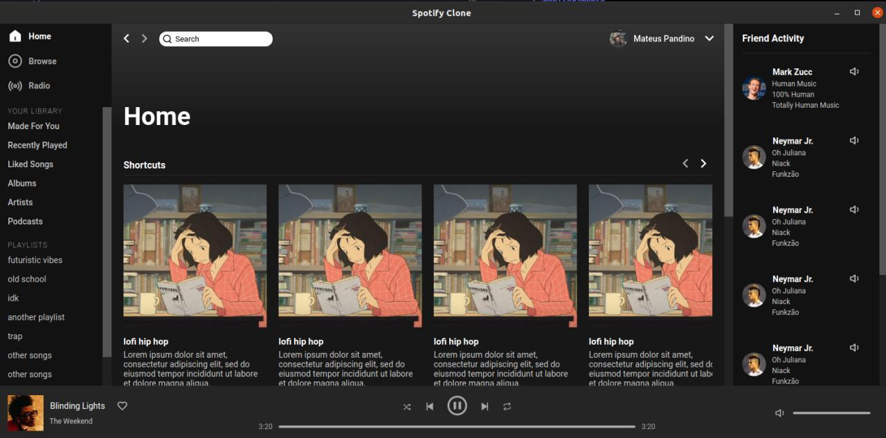

## Spotify UI Clone
Simple Spoitify UI Clone built using React + Typescript + Electron.

I also built [this template](https://www.figma.com/file/a2pddLAC6Nf3C3UZpxeQct/Spotify?node-id=0%3A1) on Figma if you are interested.



## Installation

Use a package manager of your choice (npm, yarn, etc.) in order to install all dependencies

```bash
npm install
```

```bash
yarn install
```

## Usage
In order to run this project 2 scripts will need to be executed `dev:react` and `dev:electron`, run each one in a different terminal and always run `dev:react` before `dev:electron`, or `dev` to run them in order automatically

```bash
npm run dev:react
```
```bash
npm run dev:electron
```

or

```bash
npm run dev
```

## Packaging
To generate a project package run `package`

```bash
npm run package
```


## Contributing

Pull requests are always welcome 😃.

## License

[MIT](https://choosealicense.com/licenses/mit/)
